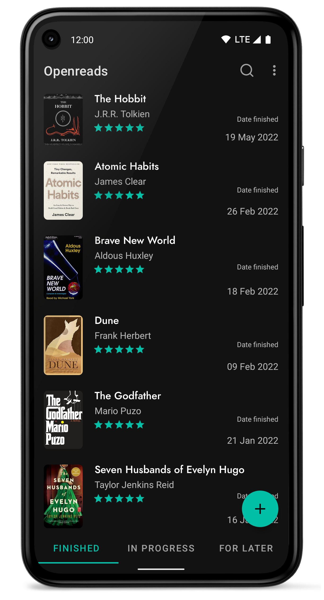
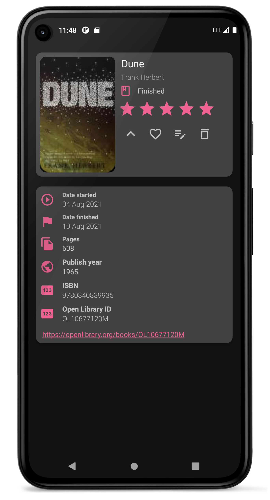
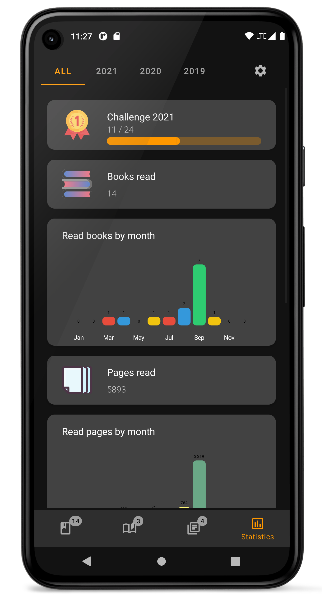

# Openreads


<p align='center'>  
 
</p>

[](https://github.com/mateusz-bak/openreads-android/releases/latest)
[](https://github.com/mateusz-bak/openreads-android/actions/workflows/test_build.yml)
[](https://crowdin.com/project/openreads-android)
<br/>

<a href='https://f-droid.org/en/packages/software.mdev.bookstracker'></a>
<a href='https://play.google.com/store/apps/details?id=software.mdev.bookstracker'></a>
<a href='https://github.com/mateusz-bak/openreads-android/releases/latest'></a>
<br/>
<a href='https://matrix.to/#/#openreads:matrix.org'></a>

<br/>

### Openreads is a privacy oriented and open source Android app written in Kotlin for keeping tracks of your books.  
#### There are four lists provided so you won't get confused:  
- books you finished,  
- books you are currently reading,  
- books you want to read later,
- books you didn't finish.

You can use custom tags and filter through them.

#### A book can be added by:
- looking it up in the Open Library database,
- scanning its barcode,
- adding its details manually.

####  You can also view some cool statistics!  

<br/><br/>
## Screenshots  
<p align='center'>  
   
     
 
</p>  

<br/><br/>

## Contributing

Do you want to support Openreads development? You are welcome to take below actions:

### Help translate Openreads:
Go to [Crowdin project](https://crwd.in/openreads-android) and start translating!

### Have you found a bug in Openreads?
Submit an issue here: [Openreads issues](https://github.com/mateusz-bak/openreads-android/issues).

### Do you have an idea that could improve Openreads for everyone?
Submit a feature request here: [Openreads issues](https://github.com/mateusz-bak/openreads-android/issues).

<br/><br/>
## Build Process

### Dependencies

- Android SDK

### Build

1. Clone or download this repository

   ```sh
   git clone https://github.com/mateusz-bak/openreads-android.git
   cd openreads-android
   ```

2. Open the project in Android Studio and run it from there or build an APK directly through Gradle:

   ```sh
   ./gradlew assembleDebug
   ```

### Deploy to device/emulator

   ```sh
   ./gradlew installDebug
   ```

*You can also replace the "Debug" with "Release" to get an optimized release binary.*

<br/><br/>
## Attributions

### Contributors

#### Testing
[Wiktor Młynarczyk](https://github.com/jokereey "jokereey")


### Used APIs
[Open Library](https://openlibrary.org/ "Open Library")


### Icons and illustrations made by
[Katerina Limpitsouni](https://undraw.co/illustrations "Katerina Limpitsouni")
<br/>
[Iconscout](https://iconscout.com/ "Iconscout")
