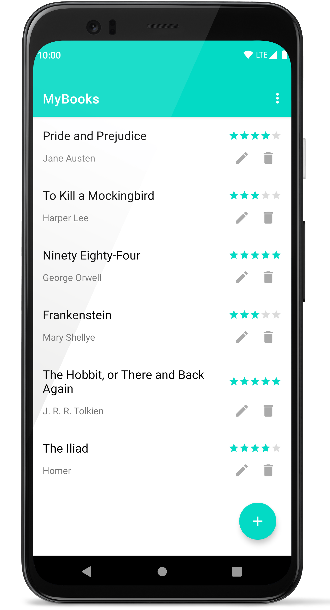
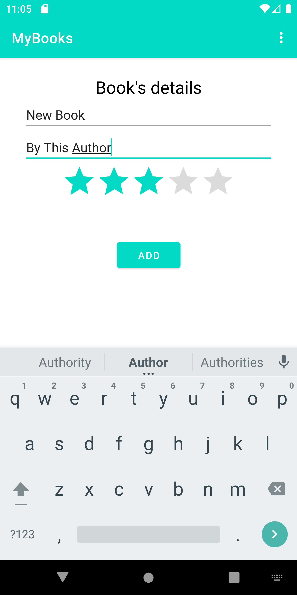
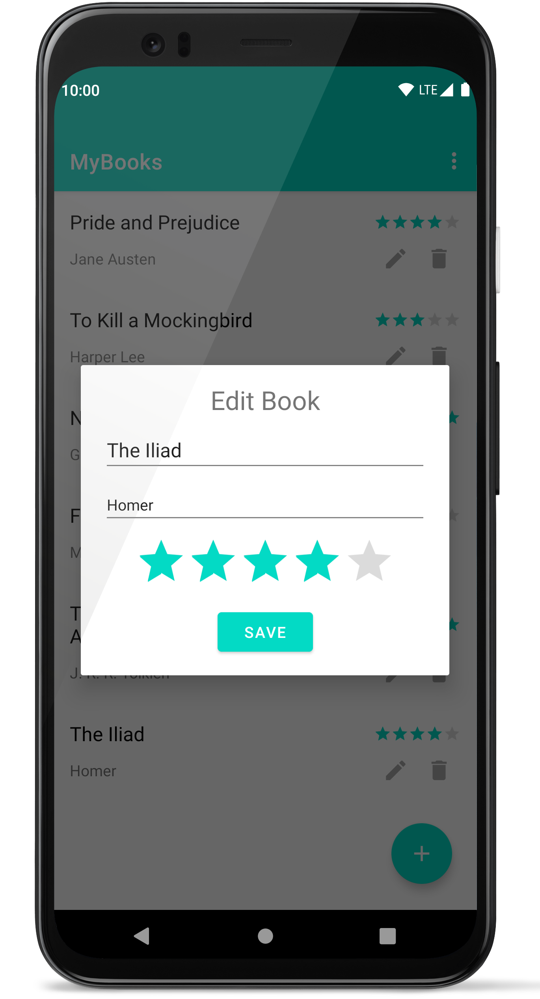

# books-tracker-android  
An Android app written in Kotlin for keeping tracks of books you have read.

## Screenshots

  
  
  
  
  
  
  
  
  
  

### List of your books:

### Adding a book:

### Editing a book:

## Attributions  
Icons made by [Freepik](https://www.freepik.com "Freepik") from [www.flaticon.com](https://www.flaticon.com/ "Flaticon")