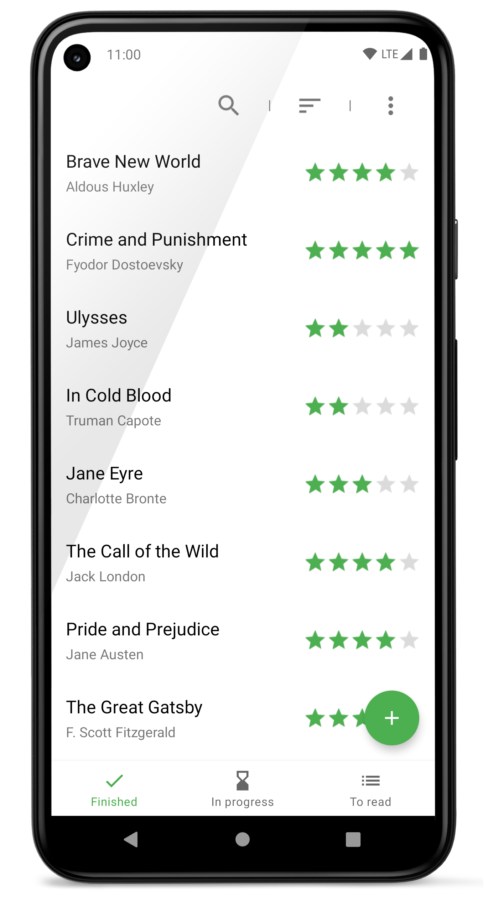
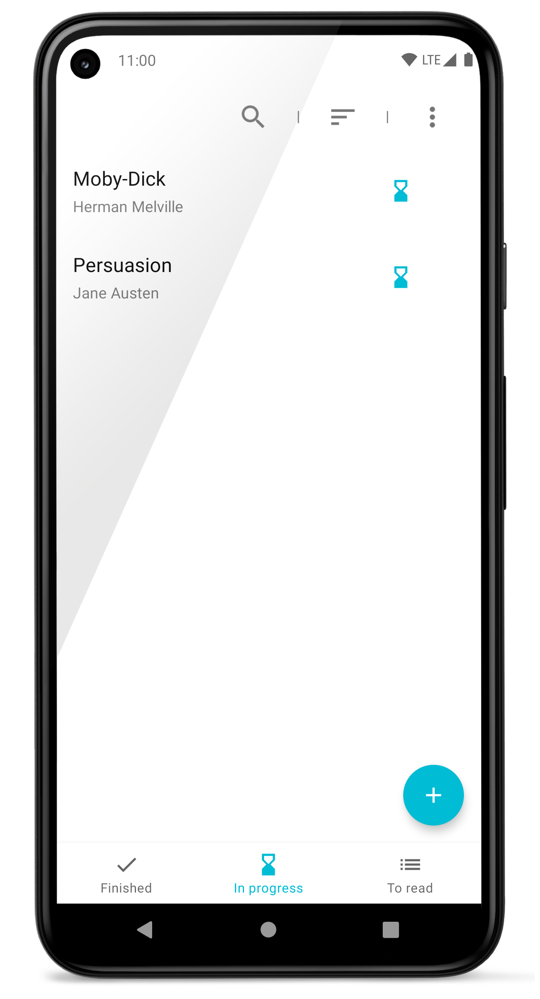
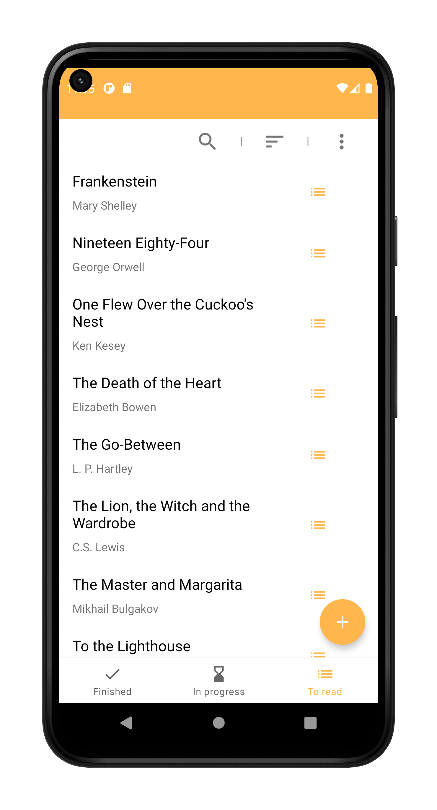
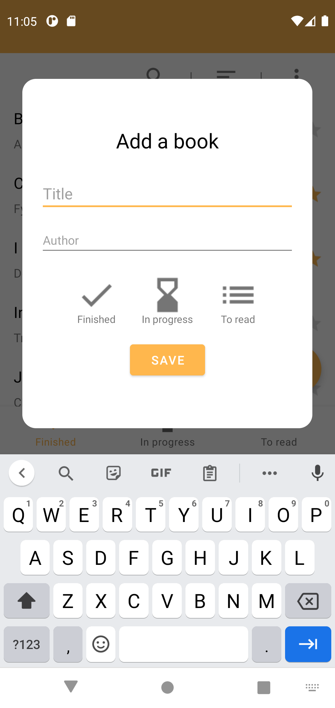

# books-tracker-android   
[](https://git-drone.mateusz.ovh/mateusz-bak/books-tracker-android)  
[](https://github.com/mateusz-bak/books-tracker-android/releases/latest)

### An Android app written in Kotlin for keeping tracks of your books.  
#### There are three lists provided so you won't get confused:  
- books you finished,  
- books you are currently reading,  
- books you want to read later.
#### Now available in 10 different color themes!  
  
## Screenshots  
<p align='center'>  
   
   
  
   
   
</p>  


## Build Process

### Dependencies

- Android SDK

### Build

1. Clone or download this repository

   ```sh
   git clone https://github.com/mateusz-bak/books-tracker-android.git
   cd books-tracker-android
   ```

2. Open the project in Android Studio and run it from there or build an APK directly through Gradle:

   ```sh
   ./gradlew assembleDebug
   ```

### Deploy to device/emulator

   ```sh
   ./gradlew installDebug
   ```

*You can also replace the "Debug" with "Release" to get an optimized release binary.*
  
## Attributions
### Icons made by:
[Smalllikeart](https://www.flaticon.com/authors/smalllikeart "Smalllikeart") from [www.flaticon.com](https://www.flaticon.com/ "Flaticon")
[Freepik](https://www.freepik.com "Freepik") from [www.flaticon.com](https://www.flaticon.com/ "Flaticon")
